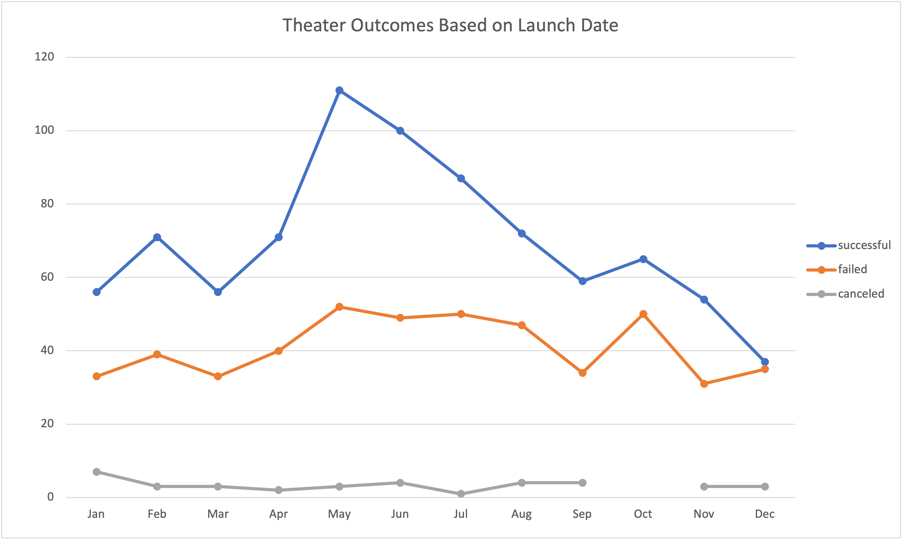
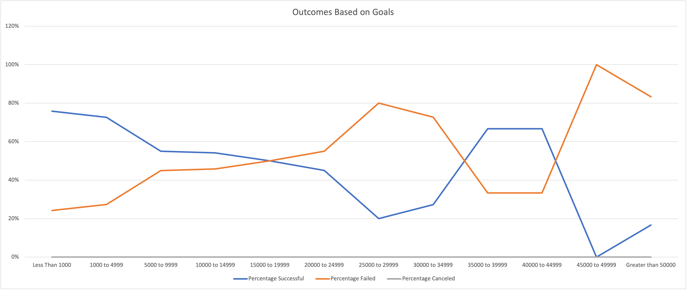

# **KICKSTARTER ANALYSIS**

## Overview Of Project

### Purpose

This project contains a  dataset from variety of crowdfunding kickstarter campaign which will be analyzed to help Louise, a playwright, start a crowdfunding campaign for her play. The purpose of this project is to analyze and visualize the campaign outcomes based on their launch dates and goal funding amount to help Louise set up her campaign to fund her upcoming play.

## Analysis And Challenges

### Analysis of Outcomes Based on Launch Date

Campaigns started in May had the most successful outcomes of 111 projects followed by the month of June with 100 successful project. Campaigns in July and October had the highest failed campaigns of 50 followed closely by June with a total of 49 projects. Also, the month of February and April and August had rougly the same number of successful campaigns. There  also tend to be more campaigns during the second quarter of the year around the month of May and June.

### Analysis of Outcomes Based on Goals

Campaigns with goals between 1000 and 4999 had the most projects with a successful outcome rate of 73%. However, the campaign with less than 1000 has the highest percentage of success with 76%.  Campaigns with goal funding between 45000 to 49999 had the highest percentage of failed outcome with only one campaign started. None of the campaigns within the goal amounts listed in column A was canceled. For all goals with failed outcome higher than the successful outcomes, goal funding greater than 50000 has the highest failed projects of 10 out of a total of 12 projects.

### Challenges and Difficulties Encountered

The amount of data available for the analysis was a bit challenging making it difficult to identify any wrong entry that could possibly produce error entries and affect the analysis. Also, another challenge was mistakenly deleting data in a cell when copying and also copying and pasting a wrong cell as a formula parameter.

## Results

- What are two conclusions you can draw about the Outcomes based on Launch Date?
  - Theater Campaigns tend to be more successful when started in May.
  -It can also be concluded the more than half of campaigns started through out the year tend to have a succesful outcome. 

- What can you conclude about the Outcomes based on Goals?
  - It can be concluded that campaigns with goals less than or greater that 9999 tend to have a successful outcome of more than 70%

- What are some limitations of this dataset?
  -High volume of data
  -
- What are some other possible tables and/or graphs that we could create?
  - A pivot table and a line graph could be created specificically for play outcomes based on launch dates to visualize whether they were be successful, failed or canceled.
  - A table can also be crested based on the location of the crowdfunding and their outcomes.